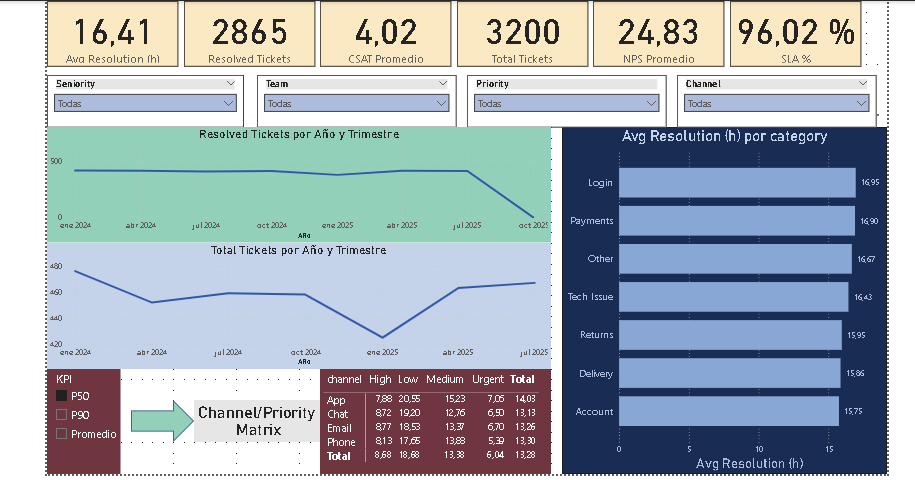
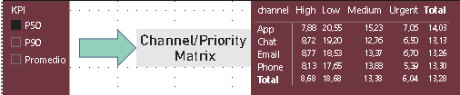
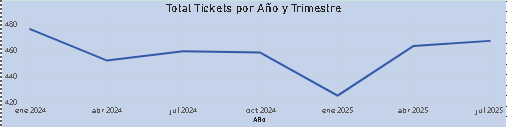
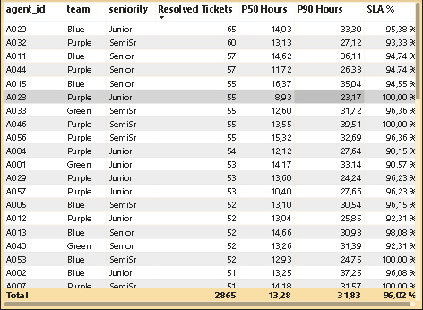

# Proyecto 3 — Power BI: Soporte / Atención al Cliente
**Rol:** Data/BI Analyst · **Herramientas:** Power BI (DAX, percentiles, parámetros)

## Objetivo
Dashboard con KPIs de tickets: SLA, tiempos (avg/p50/p90), canal × prioridad, tendencia mensual, ranking de agentes y sucursales.

## Datos
Importados desde CSV del [Proyecto 2 (PostgreSQL)](https://github.com/2005leo/proyecto-sql-soporte).

## Modelo
- Tabla `tickets` (rel. con `agents` y `surveys`).
- Columnas: *Resolution Hours*, *SLA Met*.
- Medidas: *SLA %*, *Avg Resolution (h)*, *P50 Hours*, *P90 Hours*, *Tickets Created*, *Tickets Resolved*.
- Parámetro opcional: alternar KPI (p50/p90/avg).

## Capturas

## Archivo
[`pbix/proyecto3_support_powerbi.pbix`](pbix/proyecto3_support_powerbi.pbix)
